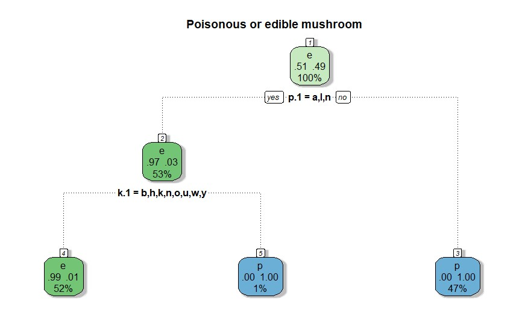
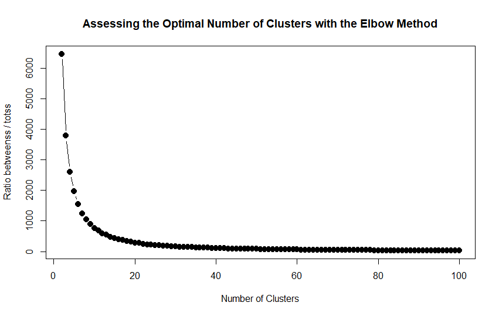
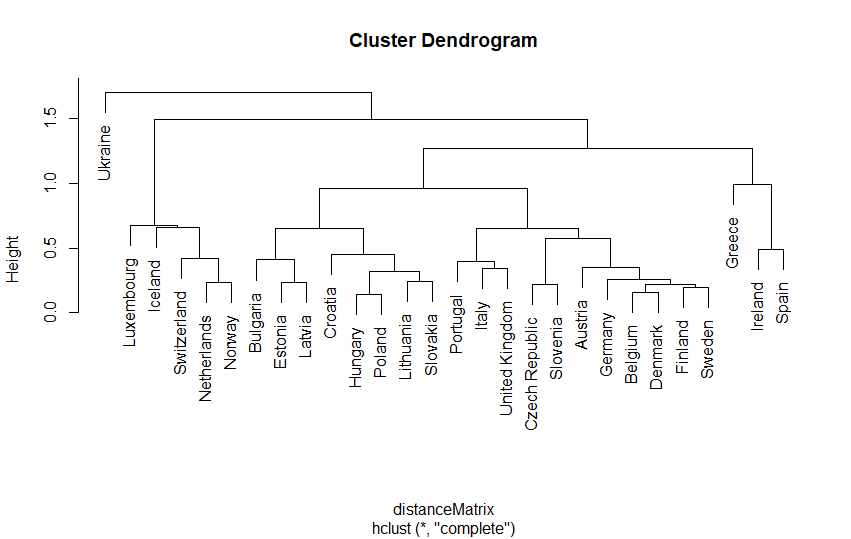
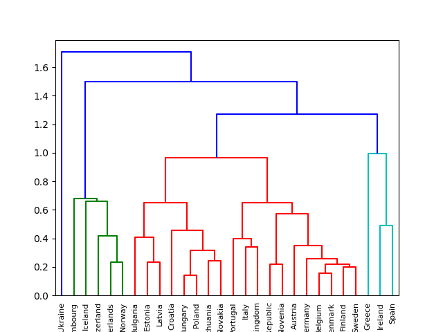

# Big Data Mining: Classification, Clustering & Association Rules in R and Python

**MSc in Applied Economics and Data Analysis**  
School of Economics and Business Administration, Department of Economics  
*Supervisor: Prof. Tzagarakis Manolis*

---

## Overview

This repository contains a Big Data analysis project wher the goal is to apply core machine learning and data mining algorithms to real-world datasets, evaluate their performance, and draw meaningful conclusions.

Every analysis in this project is implemented **twice** — once in **R** and once in **Python** — to validate results across different algorithmic implementations and demonstrate cross-language proficiency.

The project is divided into four parts:
1. **Literature Review** — Bayesian classification in finance
2. **Classification** — Decision Trees and Naïve Bayes on mushroom data
3. **Clustering** — K-Means and Hierarchical Clustering on movies and European countries
4. **Association Rules** — Apriori algorithm on fertility data

---

## File Descriptions

| File | Language | What it does |
|------|----------|-------------|
| `decision_tree.R` | R | Builds a Decision Tree classifier on the Mushroom dataset. Splits data 80/20, trains the model, evaluates with a Confusion Matrix, and manually calculates Entropy Gain for the "habitat" attribute on the first 30 observations. |
| `decision_tree.py` | Python | Replicates the R Decision Tree in Python using `scikit-learn`. Applies One-Hot Encoding on all categorical variables, trains a `DecisionTreeClassifier` with entropy criterion, evaluates performance, and additionally trains a **Naïve Bayes** (BernoulliNB) model for comparison. |
| `clustering.R` | R | Implements K-Means clustering on the MovieLens dataset using the Elbow Method (K=2 to 100) to find the optimal K=15. Then builds a movie recommendation system for a target user based on cluster mean ratings. Also implements Hierarchical Clustering on European countries data. |
| `clustering.py` | Python | Replicates both clustering analyses in Python. Uses `KModes` for categorical movie data and `AgglomerativeClustering` + `scipy.cluster.hierarchy` for the European countries dendrogram. Includes an interactive user interface for querying recommendations by user ID. |
| `association_rules.R` | R | Applies the Apriori algorithm on the Fertility Diagnosis dataset to discover association rules predicting altered fertility output. Runs with minimum support=2% and minimum confidence=100%, then filters redundant rules and sorts by Lift. |
| `report.pdf` | — | Full written report with step-by-step methodology, output tables, graphs, and interpretation of results for all four parts. |

---

## Part 1 — Literature Review: Bayesian Classification

This section analyses and compares two academic papers that use Bayesian classification in economic contexts:

**Paper 1 — Loan Risk Assessment (Tunisian Bank)**
- Uses Naïve Bayes to predict short-term loan defaults for a Tunisian commercial bank (BIAT)
- Dataset: 924 credit records from 2003–2006, with variables measuring leverage, solvency, profitability, and cash flow
- Evaluation: ROC/AUC curve — AUC = 69%, classification accuracy = 58.66%
- Key finding: Bayesian methods highlight the need for qualitative data collection in commercial banking

**Paper 2 — Recession Forecasting (Federal Reserve, Kansas)**
- Uses Naïve Bayes as a recession forecasting tool, compared against Markov-switching models and logistic regression
- Data: macro-economic variables (unemployment rate, business cycle indicators)
- Key finding: Naïve Bayes converges to its error rate faster than logistic regression — more accurate with limited data

---

## Part 2 — Classification: Decision Trees & Naïve Bayes

### Dataset
**UCI Mushroom Dataset** — 8,124 observations of mushroom species, each labelled as edible (e) or poisonous (p), with 22 categorical features (cap shape, odor, habitat, etc.).

### Decision Tree (R & Python)

**Approach:**
- Split: 80% training / 20% testing (`set.seed(2)` in R, `random_state=100` in Python)
- R: `rpart` with `method="class"` and `na.action=na.rpart`
- Python: `DecisionTreeClassifier(criterion="entropy")` after One-Hot Encoding all categorical variables

**Result — Confusion Matrix:**

|  | Predicted Edible | Predicted Poisonous |
|--|-----------------|---------------------|
| **True Edible** | 866 | 12 |
| **True Poisonous** | 0 | 747 |

**Accuracy: 99.26% — Error Rate: 0.74%**

The tree splits first on odor (almond, anise, none → likely edible), then on spore print color, reaching near-perfect classification in just a few nodes.

### Entropy Gain — Manual Calculation

Calculated manually for the "habitat" attribute on the first 30 observations:
- 4 habitat values: grasses (g), meadows (m), urban (u), woods (d)
- Entropy of the entire set: calculated from the 22 edible / 8 poisonous split
- Entropy of each split node calculated independently, then weighted by frequency

Both R and Python implementations return the same Entropy Gain value, validating the cross-language approach.

### Naïve Bayes (Python only)

- Model: `BernoulliNB` from `sklearn.naive_bayes` — appropriate for binary/One-Hot encoded features
- Same 80/20 train/test split as the Decision Tree
- Evaluated with Confusion Matrix and accuracy score

---

## Part 3 — Clustering

### 3.1 K-Means — Movie Recommendation System

**Dataset: MovieLens** — 9,125 movies with genre labels; paired with a ratings dataset containing user ratings.

**Approach:**
- R: `kmeans()` with `nstart=20`, `iter.max=20`; Python: `KModes` (Huang initialisation) — KModes is used because movie genre data is categorical, making standard Euclidean-distance K-Means unsuitable
- Elbow Method: ran clustering for K=2 to K=100, recorded within-cluster variance at each step
- Optimal K selected: **K=15**

**Elbow Method Plot (R):**

**Recommendation Logic:**
- For a target user (User ID 198), retrieve all their rated movies and their cluster assignments
- Calculate the mean rating per cluster
- Clusters with mean rating ≥ 3.5 are flagged as recommendation candidates
- Recommend top-rated (rating = 5) movies from those clusters that the user has not yet seen

### 3.2 Hierarchical Clustering — European Countries

**Dataset:** European countries with 6 socio-economic indicators: GDP, Inflation, Life Expectancy, Military spending, Population growth, Unemployment.

**Approach:**
- Preprocessing: Min-Max normalisation applied to all numeric variables to remove scale bias
- Algorithm: Agglomerative Hierarchical Clustering with **Complete Linkage**
- R: `hclust()` on a Euclidean distance matrix
- Python: `AgglomerativeClustering()` + `scipy.cluster.hierarchy.linkage()` with `method='complete'`

**Dendrogram (R):**

**Dendrogram (Python — colour-coded clusters):**

The dendrograms reveal clear groupings: Nordic/wealthy countries (Luxembourg, Switzerland, Norway) cluster together, while Eastern European countries form a separate group. Ukraine appears as a clear outlier.

---

## Part 4 — Association Rules: Apriori Algorithm

### Dataset
**Fertility Diagnosis Dataset** — 100 records with lifestyle and medical variables: season, childhood disease history, trauma, surgical interventions, fevers, alcohol use, smoking habits, and fertility output (Normal / Altered).

### Approach

- Library: `arules` in R
- Removed non-informative columns (age, sitting hours) before applying the algorithm
- All remaining variables converted to factors
- First run: no support/confidence constraints — all possible rules generated
- Second run with constraints:
  - Minimum support: **2%** (supp=0.02)
  - Minimum confidence: **100%** (conf=1)
  - Minimum rule length: **2 items** (minlen=2)
  - Right-hand side fixed to `output=O` (altered fertility)
- Rules sorted by **Lift** (descending)
- Redundant rules removed using `is.redundant()`

### Results

The filtered rule set contains deterministic rules (confidence=100%) — meaning whenever the left-hand side conditions are met, altered fertility is predicted with certainty. High lift values indicate these rules perform significantly better than random chance.

---

## Technologies & Libraries

### Python
- `pandas`, `numpy` — Data manipulation
- `matplotlib` — Visualisation
- `scikit-learn` — Decision Tree, Naïve Bayes, Hierarchical Clustering, preprocessing
- `kmodes` — K-Modes clustering for categorical movie data
- `scipy` — Hierarchical clustering and dendrogram plotting

### R
- `rpart`, `rpart.plot`, `rattle` — Decision Trees and visualisation
- `e1071` — Naïve Bayes
- `amap`, `MASS`, `klaR` — Clustering support
- `arules` — Apriori association rule mining
- `ggplot2` — Visualisation

## License

This project is licensed under the MIT License — see the [LICENSE](LICENSE) file for details.
